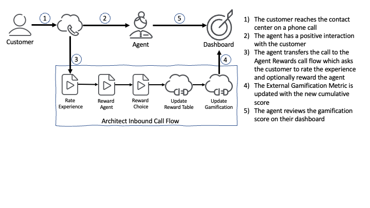

# Build an agent rewards using Genesys Cloud Gamification External Metrics

> View the full [Agent Rewards Blueprint](https://developer.mypurecloud.com/blueprints/agent-rewards-blueprint/ "Goes to the Agent Rewards Blueprint") in the Genesys Cloud Developer Center.

This Genesys Cloud Developer Blueprint provides instructions for building an agent rewards using Genesys Cloud Gamification External Metrics. The goal of this blueprint is to survey a customer after their interaction with an agent and, if their experience was positive, offer to the agent a reward of the customer’s choice.  This action empowers the customer to thank the agent in a tangible way, builds customer loyalty between the customer and the brand, and of course rewards great agents. You can deploy all the components used in this solution with the Terraform Genesys Cloud CX as Code provider.

