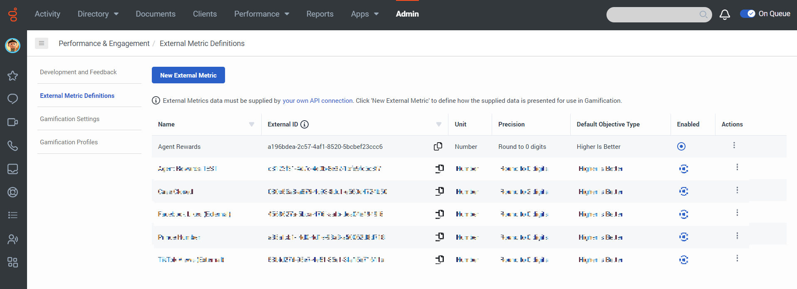
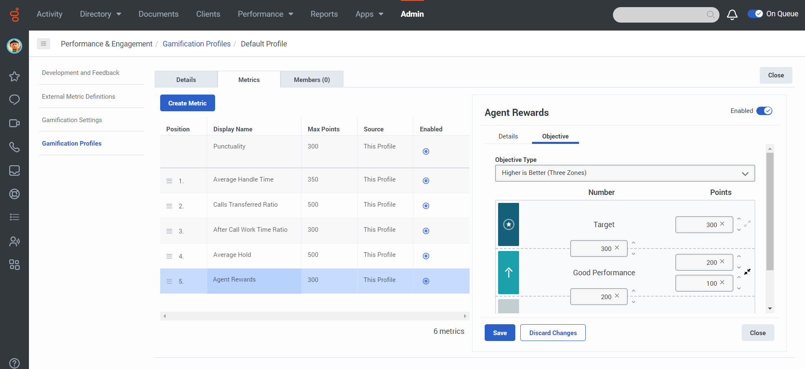
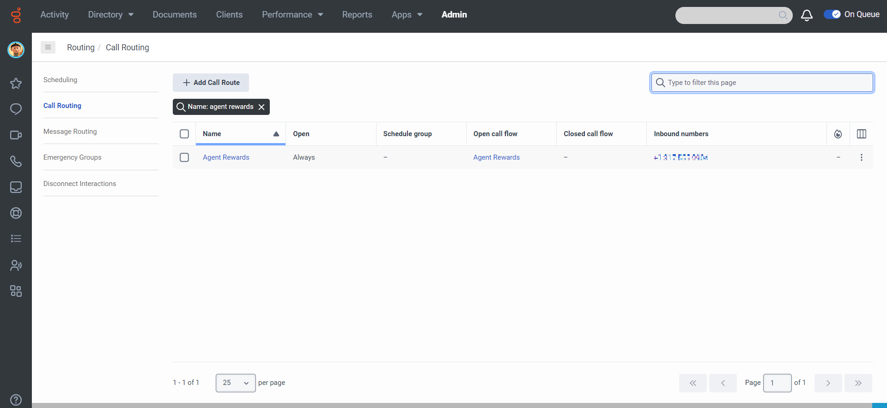
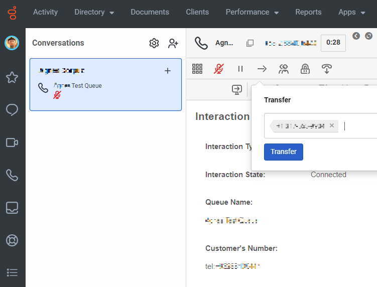
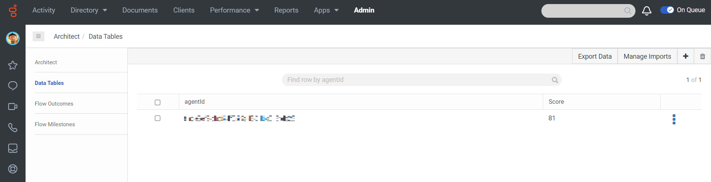
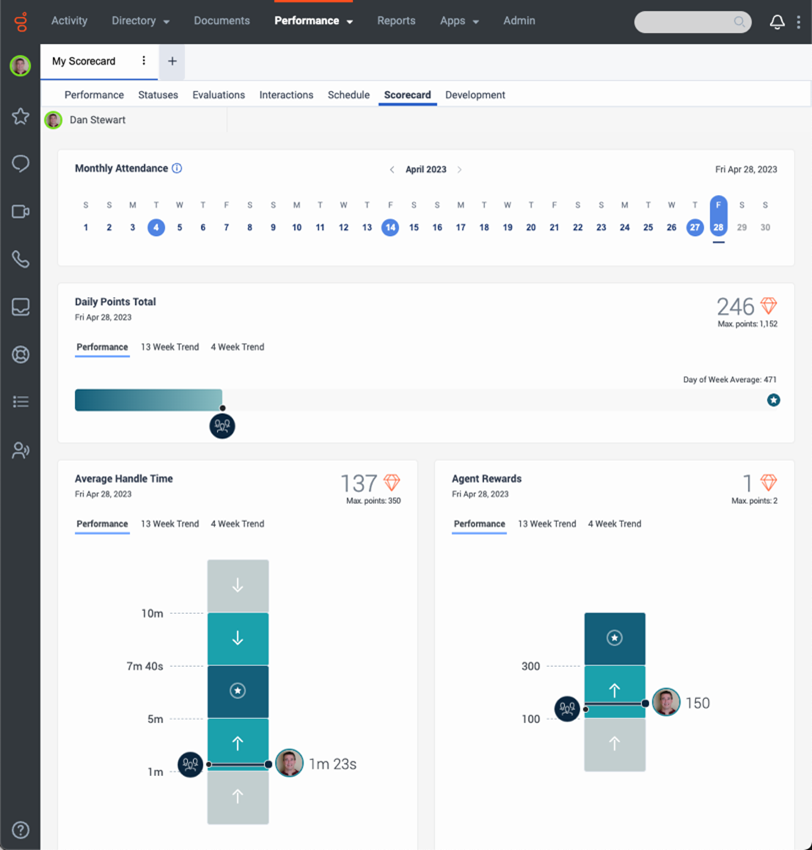

:::{"alert":"primary","title":"About Genesys Cloud Blueprints","autoCollapse":false} 
Genesys Cloud blueprints were built to help you jump-start building an application or integrating with a third-party partner. 
Blueprints are meant to outline how to build and deploy your solutions, not a production-ready turn-key solution.
 
For more details on Genesys Cloud blueprint support and practices 
please see our Genesys Cloud blueprint [FAQ](https://developer.genesys.cloud/blueprints/faq)sheet.
:::

Welcome to the wonderful world of employee rewards.  This blueprint is a great opportunity for you to learn about how Genesys Cloud Gamification External Metrics (GCGEM) can be used in conjunction with a simple voice survey to enable your customers to reward your agents.

The goal of this blueprint is to survey a customer after their interaction with an agent and, if their experience was positive, offer to the agent a reward of the customer’s choice.

To invoke this experience, an agent uses their desktop to transfer the voice interaction to an Architect Inbound Call Flow which interacts with the customer and then updates a Genesys Cloud Data Table that keeps track of the agent’s cumulative reward score. The reward score is written to a Gamification External Metric that is displayed on the agent’s Scorecard.

This Blueprint provides all the components to accomplish a simple agent rewards solution. It is important to note that rewards presented to the customer are converted into a point system for the agent. There are many reasons for this abstraction, one of which is that rewarding a busy agent with hundreds of cups of coffee might not turn out to be a good thing. For this reason, converting the rewards and associated reward points into actual benefits for the agent is an exercise left to the reader.

This Blueprint is going to take you through the steps and definitions to configure your Genesys Cloud organization.


## Scenario

An organization wants to empower the customer to thank the agent in a tangible way, builds customer loyalty between the customer and the brand, and of course rewards great agents.

1. **Ask the customer if their experience with the agent was positive**

2. **Ask the customer if they would like to reward the agent**

3. **Ask the customer to pick a reward for the agent**

## Solution components

* **Genesys Cloud CX** - A suite of Genesys Cloud services for enterprise-grade communications, collaboration, and contact center management. In this solution, you use an Architect inbound message flow, a Genesys Cloud integration, a Genesys Cloud queue, web messaging configuration, and web messaging deployment.
* **Architect flows** - A flow in Architect, a drag and drop web-based design tool, dictates how Genesys Cloud handles inbound or outbound interactions.  In this solution, an inbound call flow provides the routing layer that gets the customer to the right queue.
* **Genesys Cloud Gamification External Metrics** - Performance management and Gamification is focused on defining performance goals and expectations, and then measuring against these goals to see how individuals and teams are performing. This feature allows you to import external metrics and make them an integral part of an employee’s performance scorecard. As a result, supervisors receive a single and complete view of agent performance on all key measures that your organization cares about.
* **Data Action** - Provides the integration point to invoke a third-party REST web service or AWS lambda.
* **CX as Code** - A Genesys Cloud Terraform provider that provides an interface for declaring core Genesys Cloud objects.

## Prerequisites

### Specialized knowledge

* Administrator-level knowledge of Genesys Cloud
* Experience with Terraform

### Genesys Cloud account

* A Genesys Cloud license. For more information, see [Genesys Cloud Pricing](https://www.genesys.com/pricing "Opens the Genesys Cloud pricing page") in the Genesys website.
* The Master Admin role. For more information, see [Roles and permissions overview](https://help.mypurecloud.com/?p=24360 "Opens the Roles and permissions overview article") in the Genesys Cloud Resource Center.
* CX as Code. For more information, see [CX as Code](https://developer.genesys.cloud/devapps/cx-as-code/ "Goes to the CX as Code page") in the Genesys Cloud Developer Center.

### Development tools running in your local environment

* Terraform (the latest binary). For more information, see [Download Terraform](https://www.terraform.io/downloads.html "Goes to the Download Terraform page") on the Terraform website.

## Implementation steps

### Download the repository containing the project files

1. Clone the [agent-rewards-external-metrics-blueprint repository](https://github.com/GenesysCloudBlueprints/agent-rewards-external-metrics-blueprint "Opens the agent-rewards-external-metrics-blueprint repository in GitHub").

### Set up Genesys Cloud

1. To run this project using the Terraform provider, open a Terminal window and set the following environment variables:

 * `GENESYSCLOUD_OAUTHCLIENT_ID` - This variable is the Genesys Cloud client credential grant Id that CX as Code executes against. 
 * `GENESYSCLOUD_OAUTHCLIENT_SECRET` - This variable is the Genesys Cloud client credential secret that CX as Code executes against. 
 * `GENESYSCLOUD_REGION` - This variable is the Genesys Cloud region in your organization.

2. Run Terraform in the folder where you set the environment variables. 

### Configure your Terraform build

In the **blueprint/terraform/dev.auto.tfvars** file, set the following values, which are specific to your Genesys Cloud organization:

* `client_id` - The value of your OAuth Client ID using Client Credentials to be used for the data action integration.
* `client_secret`- The value of your OAuth Client secret using Client Credentials to be used for the data action integration.

The following is an example of the dev.auto.tfvars file.

```
client_id       = "your-client-id"
client_secret   = "your-client-secret"
```

### Run Terraform

You are now ready to run this blueprint solution for your organization. 

1. Change to the **/terraform** folder and issue these commands:

* `terraform init` - This command initializes a working directory containing Terraform configuration files.
  
* `terraform plan` - This command executes a trial run against your Genesys Cloud organization and shows you a list of all the Genesys Cloud resources it creates. Review this list and make sure that you are comfortable with the plan before continuing to the second step.

* `terraform apply --auto-approve` - This command creates and deploys the necessary objects in your Genesys Cloud account. The --auto-approve flag completes the required approval step before the command creates the objects.

After the `terraform apply --auto-approve` command completes, you should see the output of the entire run along with the number of objects successfully created by Terraform. Keep these points in mind:

*  This project assumes you are running using a local Terraform backing state, which means that the `tfstate` files are created in the same folder where you run the project. Terraform does not recommend using local Terraform backing state files unless you run from a desktop and are comfortable with the deleted files.

* As long as you keep your local Terraform backing state projects, you can tear down this blueprint solution by changing to the `docs/terraform` folder and issuing a `terraform destroy --auto-approve` command. This command destroys all objects currently managed by the local Terraform backing state.

### Gamification External Metric

1. Get the External Metric ID by going to **Admin** > **Performance & Engagement** > **External Metric Definitions**
   
2. Include the External Metric in the Gamification Profile in **Admin** > **Performance & Engagement** > **Gamification Profiles**. You can set the parameters for your points to show Targets, Good Performance, and Out of Bounds.
   

### Test the solution

1. In Genesys Cloud Admin, assign a number to the created inbound call flow.
   

2. As a customer, make a call to a number assigned to an assigned agent.
3. As an agent, go On Queue and answer the incoming call.
4. Make a Blind Transfer to the number assigned to the Agent Rewards call flow.
   
5. The customer is greeted with an audio prompt saying *"Thank you for participating in a review of your call. Given your experience, how likely are you to recommend our company to your family or friends.  For extremely likely, press 1.  For very likely, press 2.  For moderately likely, press 3.  For slightly likely, press 4.  And for not at all likely, press 5."*
6. If the customer pressed 1, 2 or 3, the audio prompt will say *"Would you like to reward your agent for their help on the call.  For yes, press 1.  For no, press 2."*
7. If the customer wants to reward the agent, the audio proompt will ask from a list on what to reward the agent by saying *"Which reward would you like us to give the agent.  This is at no cost to you.  For a high five, press 1.  For a soft drink, press 2.  For a delivered snack, press 3.  Or for a specialty coffee, press 4."*
8. Which ever the customer chooses, the audio prompt will confirm the reward will be given to the agent and the agent will earn a score accordingly:
   * High Five - 10 points
   * Soft drink - 20 points
   * Snack - 30 points
   * Coffee - 40 points
9. The audio prompt will now say *"Thank you for the review.  Goodbye."* and will end the voice interaction.
10. The data table will be updated to add the agent's new score.
    

  :::primary
  **Tip**: The agent ID should already be existing in the data table to earn points.
  :::
11. The agent's scorecard will reflect the points earned from the Agent Rewards under **Performance** > **Scorecard**
    


## Additional resources

* [Gamification](https://www.genesys.com/capabilities/gamification-call-center-employees "Opens the Gamification page")
* [Configure external metrics for performance scorecards](https://help.mypurecloud.com/articles/configure-external-metrics-for-performance-scorecards/ "Opens the Configure external metrics for performance scorecards page")
